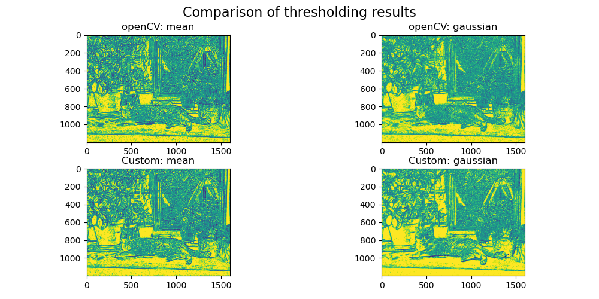

# ImageSegmentation
This repo is designed to test and implement various procedures and to expand my own understanding.

Hier habe ich ein Adaptives Thresholding implementiert und vergleiche es mit der OpenCV implementierung.

